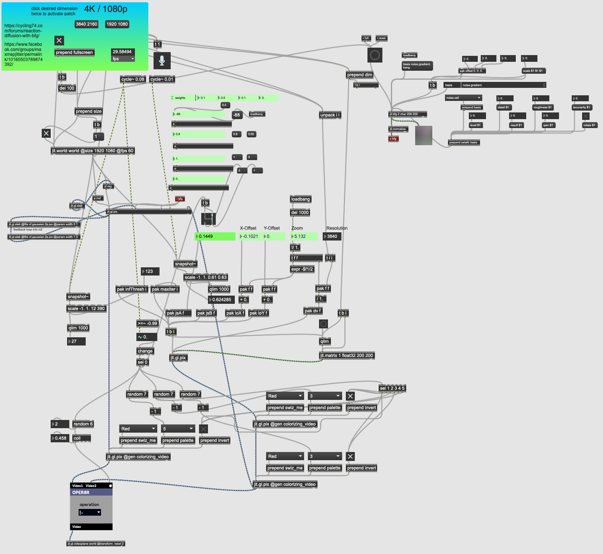

This patcher overlays the Gray-Scott Reaction Diffusion algorithm onto the Julia Set fractal.

Video: https://www.youtube.com/watch?v=YkiI2IpYrAg

Based on these two patches:

- https://cycling74.com/forums/reaction-diffusion-with-bfg/

- https://www.facebook.com/groups/maxmspjitter/permalink/10160503789874392/

